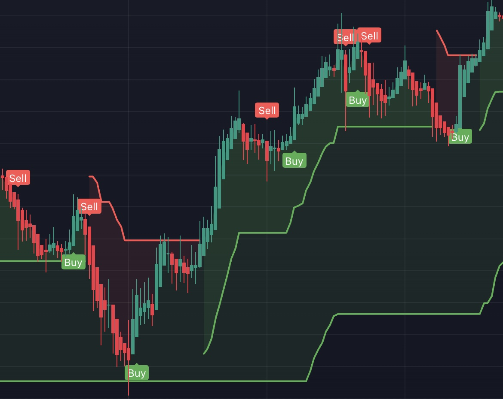

# tradingview-indicators

## TripleSuperTrend

Apologies - 100% derived from [KivancOzbilgic](https://www.tradingview.com/u/KivancOzbilgic/). 

New to the tradingview script community, not sure the best way to site [sources](https://www.tradingview.com/script/r6dAP7yi/).

After watching this [video](https://www.youtube.com/watch?v=ohv3Hs94lNU)
I wanted to combine 3 supertrend indicators into one because I'm too cheap to pay for tradingview, and you can only use 3 indicators at once on the free version. I set the defaults based on the video. 
- The short SuperTrend multiplier is set to 1.2 and triggers the buy/sell signals, but does not plot the trend
- The medim SuperTrend multiplier is set to 3 and plots the trend without buy/sell signals
- The long SuperTrend multiplier is set to 10 and plots the trend without buy/sell signals
- The video recommends using Heiken Ashi chart indicators rather than candles

The general idea is that the medium and long SuperTrends show the strength of the buy signal. 
It's best used in a trending market (obviously).

It's my first attempt at pinescript - code is not beautiful 

